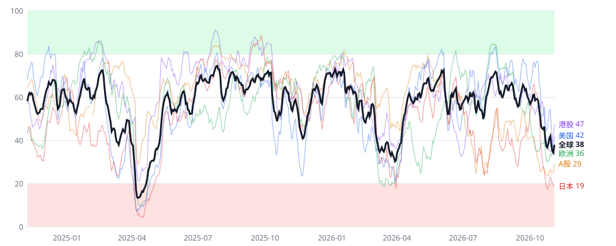
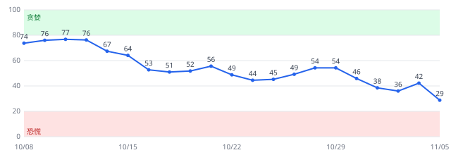
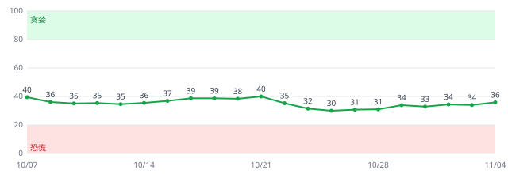
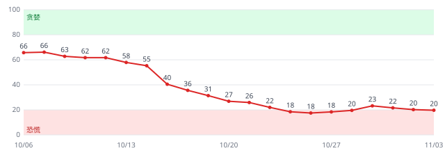
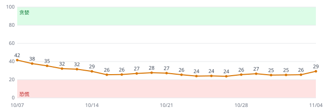
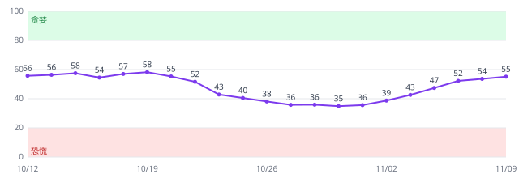

# 全球市场恐慌指数

每天自动更新的 0–100 恐慌贪婪指数，覆盖美国、欧洲、日本、A股、港股。0 = 极度恐慌，100 = 极度贪婪。仅供个人判断市场情绪参考，不构成投资建议。

<!-- latest:start -->
**最新读数（2026-11-11 收盘，0 = 极度恐慌，100 = 极度贪婪）**

| 区域 | 恐慌贪婪指数 | 状态 | 5日变化 | 仓位信号 |
| --- | --- | --- | --- | --- |
| 全球 | 37 | 恐慌 | -0.7 | 恐慌加深，减仓 |
| 美国 | 33 | 恐慌 | -9.1 | 恐慌加深，减仓 |
| 欧洲 | 44 | 中性 | +8.2 | 正常 |
| 日本 | 14 | 极度恐慌 | -5.0 | 恐慌加深，减仓 |
| A股 | 35 | 恐慌 | +6.3 | 正常 |
| 港股 | 56 | 中性 | +8.1 | 正常 |

⚠️ sh_margin 已 6 天未更新（最后 2026-11-05）



## 分区域明细

### 美国：33（恐慌）

5日变化 -9.1 · 仓位信号：恐慌加深，减仓

| 成分 | 今日 | 5日前 | 20日前 | 权重 |
| --- | --- | --- | --- | --- |
| **美国恐慌贪婪指数** | **33** | 42 | 67 | — |
| VIX | 52 | 61 | 58 | 1 |
| VIX/VIX3M 期限结构 | 38 | 52 | 43 | 0.75 |
| 标普500 20日实际波动率 | 13 | 56 | 79 | 0.75 |
| 标普500 距52周高点回撤 | 47 | 54 | 59 | 1 |
| 高收益债相对国债回撤（HYG/IEF） | 45 | 32 | 58 | 1 |
| 标普500 10日急跌 | 21 | 28 | 52 | 0.5 |



### 欧洲：44（中性）

5日变化 +8.2 · 仓位信号：正常

| 成分 | 今日 | 5日前 | 20日前 | 权重 |
| --- | --- | --- | --- | --- |
| **欧洲恐慌贪婪指数** | **44** | 36 | 36 | — |
| 欧洲斯托克50 20日实际波动率 | 33 | 44 | 59 | 1.25 |
| 欧洲斯托克50 回撤 | 61 | 39 | 30 | 1 |
| 欧洲斯托克50 低于125日均线幅度 | 47 | 32 | 27 | 0.75 |
| 瑞郎避险升值 | 24 | 8 | 16 | 0.5 |
| 欧洲斯托克50 10日急跌 | 86 | 58 | 27 | 0.5 |



### 日本：14（极度恐慌）

5日变化 -5.0 · 仓位信号：恐慌加深，减仓

| 成分 | 今日 | 5日前 | 20日前 | 权重 |
| --- | --- | --- | --- | --- |
| **日本恐慌贪婪指数** | **14** | 19 | 55 | — |
| 日经225 20日实际波动率 | 6 | 19 | 29 | 1.25 |
| 日经225 回撤 | 3 | 5 | 47 | 1 |
| 日经225 低于125日均线幅度 | 4 | 5 | 56 | 0.75 |
| 日元20日急升 | 51 | 38 | 69 | 0.5 |
| 日经225 10日急跌 | 17 | 17 | 76 | 0.5 |
| TOPIX 回撤（全市场） | 32 | 32 | 67 | 1 |



### A股：35（恐慌）

5日变化 +6.3 · 仓位信号：正常

| 成分 | 今日 | 5日前 | 20日前 | 权重 |
| --- | --- | --- | --- | --- |
| **A股恐慌贪婪指数** | **35** | 29 | 29 | — |
| 50ETF 期权波动率 QVIX | 97 | 75 | 67 | 1 |
| 沪深300 20日实际波动率 | 31 | 31 | 66 | 0.5 |
| 沪深300 回撤 | 18 | 19 | 26 | 1 |
| 两市成交量萎缩 | 1 | 0 | 2 | 0.75 |
| 沪市融资余额下降 | 2 | 2 | 8 | 0.75 |
| 沪深300 10日急跌 | 53 | 52 | 1 | 1 |



### 港股：56（中性）

5日变化 +8.1 · 仓位信号：正常

| 成分 | 今日 | 5日前 | 20日前 | 权重 |
| --- | --- | --- | --- | --- |
| **港股恐慌贪婪指数** | **56** | 47 | 58 | — |
| 恒指 20日实际波动率 | 43 | 70 | 90 | 1.25 |
| 恒指 回撤 | 55 | 49 | 55 | 1 |
| 恒指 低于125日均线幅度 | 47 | 38 | 40 | 0.75 |
| 恒生科技跑输恒指 | 32 | 11 | 43 | 0.5 |
| 恒指 10日急跌 | 89 | 64 | 45 | 1 |


<!-- latest:end -->

## 怎么算的

1. 每个区域 5–6 个成分：波动率指数、实际波动率、回撤、偏离均线、10 日急跌、高收益债相对国债表现、避险资产等（完整清单见 `fearindex/config.py`）。10 日急跌成分让指数对短期急跌反应更快，A股、港股权重较高。日本另有 TOPIX 回撤成分：日经225 受少数高价股左右，TOPIX 覆盖全市场，更接近多数股票的涨跌。
2. 每个成分换算成过去 1260 个交易日（约 5 年）里的分位数 × 100，最后整体翻转为 0 = 极度恐慌、100 = 极度贪婪。
3. 区域分 = 成分加权平均；全球分 = 区域按市值大致加权（美 45%、欧 20%、日 10%、A 15%、港 10%）× 90% + 全球公共成分（美债波动率、黄金、美债避险）× 10%。
4. 最终做 3 日指数平滑。
5. 仓位信号：某区域分数 ≤ 40 且低于 20 个交易日前，连续 2 天成立时提示“恐慌加深，减仓”（回测中半仓执行）。连续 2 天的要求用来减少信号来回开关。
6. 极端行情提示（仅供参考，不参与减仓规则）：
   - **恐慌解除（可能触底）**：分数在 60 个交易日内曾 ≤ 20，之后回升到 50 以上，提示显示 5 个交易日。
   - **短期触底**：不要求跌到极度恐慌。10 个交易日内分数下跌至少 10 分、低点不高于 50，之后从低点回升至少 8 分，提示显示 5 个交易日。回测中提示之后 20 个交易日内守住前期低点的比例，2018 年以前 65%（平时 46%），2019 年以后 71%（平时 50%）；但之后 60 日的表现并不比平时好（2018 年以前，之后 60 天里再跌超过 10% 的比例是 30%，平时 23%），所以只说明“短期低点可能已经出现”，不是买入信号。慢慢阴跌后的反弹（例如 2026 年 3 月的美股）不一定能识别。
   - **贪婪退潮（可能触顶）**：分数在 60 个交易日内曾 ≥ 85，之后回落到 65 以下，提示显示 5 个交易日。
   - 回测显示“可能触底”和“可能触顶”都没有可靠的预测力：2018 年以前，触底提示之后 60 天里有 33% 的时候市场又跌了超过 10%（平时是 23%）；触顶提示之后市场多半还在涨。详见 `reports/backtest.md` 末尾。

## 怎么用

回测（2001–2026）显示，这个指数和下跌基本同步，不是提前预警：通常跌了 5–13% 之后才降到 30 以下。高恐慌之后的走势分两种：2019 年以前多为继续下跌，2019 年以后多为快速反弹，所以单纯“越恐慌越加仓”并不稳。更可靠的用法是：恐慌还在加深时降低仓位，等分数从低位回升、仓位信号恢复正常后再加回。

| 分数 | 状态 |
| --- | --- |
| 0–20 | 极度恐慌 |
| 20–40 | 恐慌 |
| 40–60 | 中性 |
| 60–80 | 贪婪 |
| 80–100 | 极度贪婪 |

## 文件

- `data/index.csv`：每日全球及各区域分数
- `data/components.csv`：各成分分位得分；`data/components_raw.csv`：成分原始值
- `data/latest.json`：最新读数与数据健康状态
- `docs/index.html`：交互式仪表盘；`docs/chart.svg`：近两年走势图
- `reports/backtest.md`：回测报告
- `reports/verification.md`：每日数据核查（重算分数、核对发布文件、与第二数据源比对）

## 运行

```bash
pip install -r requirements.txt
python scripts/run_daily.py          # 增量更新（首次会自动拉全部历史）
python scripts/run_backtest.py       # 生成回测报告
python -m pytest -q                  # 单元测试（合成数据）
```

GitHub Actions 每周一至周五北京时间 06:30 自动运行 `daily-update`，07:20 再跑一次备用（GitHub 定时常延迟一小时以上，重复运行无副作用），失败时 GitHub 会发邮件提醒。

数据源：Yahoo Finance、AkShare（东方财富 / 腾讯 / 新浪指数行情、金十融资余额、期权论坛 QVIX），A股行情按顺序自动切换备用源。
