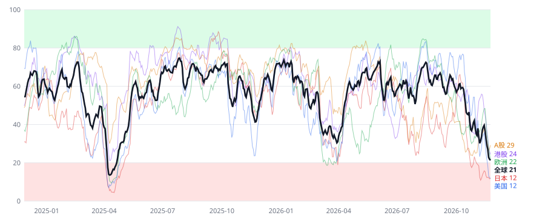

# 全球市场恐慌指数

每天自动更新的 0–100 恐慌贪婪指数，覆盖美国、欧洲、日本、A股、港股。0 = 极度恐慌，100 = 极度贪婪。仅供个人判断市场情绪参考，不构成投资建议。

<!-- latest:start -->
**最新读数（2026-11-26 收盘，0 = 极度恐慌，100 = 极度贪婪）**

| 区域 | 恐慌贪婪指数 | 状态 | 5日变化 | 仓位信号 |
| --- | --- | --- | --- | --- |
| 全球 | 19 | 极度恐慌 | -8.1 | 恐慌加深，减仓 |
| 美国 | 10 | 极度恐慌 | -8.2 | 恐慌加深，减仓 |
| 欧洲 | 17 | 极度恐慌 | -15.0 | 恐慌加深，减仓 |
| 日本 | 9 | 极度恐慌 | -3.4 | 恐慌加深，减仓 |
| A股 | 26 | 恐慌 | -3.4 | 正常 |
| 港股 | 22 | 恐慌 | -10.8 | 恐慌加深，减仓 |



## 分区域明细

### 美国：10（极度恐慌）

5日变化 -8.2 · 仓位信号：恐慌加深，减仓

| 成分 | 今日 | 5日前 | 20日前 | 权重 |
| --- | --- | --- | --- | --- |
| **美国恐慌贪婪指数** | **10** | 18 | 54 | — |
| VIX | 11 | 7 | 54 | 1 |
| VIX/VIX3M 期限结构 | 1 | 1 | 49 | 0.75 |
| 标普500 20日实际波动率 | 3 | 12 | 79 | 0.75 |
| 标普500 距52周高点回撤 | 25 | 25 | 60 | 1 |
| 高收益债相对国债回撤（HYG/IEF） | 9 | 27 | 44 | 1 |
| 标普500 10日急跌 | 4 | 16 | 35 | 0.5 |


### 欧洲：17（极度恐慌）

5日变化 -15.0 · 仓位信号：恐慌加深，减仓

| 成分 | 今日 | 5日前 | 20日前 | 权重 |
| --- | --- | --- | --- | --- |
| **欧洲恐慌贪婪指数** | **17** | 32 | 34 | — |
| 欧洲斯托克50 20日实际波动率 | 14 | 35 | 52 | 1.25 |
| 欧洲斯托克50 回撤 | 21 | 25 | 32 | 1 |
| 欧洲斯托克50 低于125日均线幅度 | 13 | 17 | 27 | 0.75 |
| 瑞郎避险升值 | 18 | 51 | 5 | 0.5 |
| 欧洲斯托克50 10日急跌 | 4 | 21 | 53 | 0.5 |


### 日本：9（极度恐慌）

5日变化 -3.4 · 仓位信号：恐慌加深，减仓

| 成分 | 今日 | 5日前 | 20日前 | 权重 |
| --- | --- | --- | --- | --- |
| **日本恐慌贪婪指数** | **9** | 12 | 23 | — |
| 日经225 20日实际波动率 | 4 | 10 | 12 | 1.25 |
| 日经225 回撤 | 1 | 2 | 17 | 1 |
| 日经225 低于125日均线幅度 | 1 | 2 | 18 | 0.75 |
| 日元20日急升 | 51 | 50 | 39 | 0.5 |
| 日经225 10日急跌 | 5 | 19 | 47 | 0.5 |
| TOPIX 回撤（全市场） | 6 | 12 | 45 | 1 |


### A股：26（恐慌）

5日变化 -3.4 · 仓位信号：正常

| 成分 | 今日 | 5日前 | 20日前 | 权重 |
| --- | --- | --- | --- | --- |
| **A股恐慌贪婪指数** | **26** | 29 | 26 | — |
| 50ETF 期权波动率 QVIX | 79 | 88 | 84 | 1 |
| 沪深300 20日实际波动率 | 56 | 41 | 42 | 0.5 |
| 沪深300 回撤 | 8 | 12 | 16 | 1 |
| 两市成交量萎缩 | 0 | 2 | 0 | 0.75 |
| 沪市融资余额下降 | 1 | 3 | 2 | 0.75 |
| 沪深300 10日急跌 | 12 | 15 | 16 | 1 |


### 港股：22（恐慌）

5日变化 -10.8 · 仓位信号：恐慌加深，减仓

| 成分 | 今日 | 5日前 | 20日前 | 权重 |
| --- | --- | --- | --- | --- |
| **港股恐慌贪婪指数** | **22** | 33 | 35 | — |
| 恒指 20日实际波动率 | 39 | 51 | 68 | 1.25 |
| 恒指 回撤 | 31 | 37 | 39 | 1 |
| 恒指 低于125日均线幅度 | 10 | 19 | 18 | 0.75 |
| 恒生科技跑输恒指 | 12 | 25 | 11 | 0.5 |
| 恒指 10日急跌 | 5 | 4 | 9 | 1 |


<!-- latest:end -->

<!-- commentary:start -->
### 今日情绪解读（2026-11-26 收盘，Claude 自动生成）

#### 一句话结论

截至 2026-11-26，五个区域均处于恐慌一侧。全球读数为 19.4，是过去一年的最低值；美国、欧洲、日本、港股也都在今天创下一年新低。A股读数为 30.1，相对抗跌。

#### 各区域情绪

- **美国 10.3（极度恐慌）**：5 日下降 8.2，比 10 月 29 日低约 44，已在 ≤20 的恐慌买入区内，同时指数提示“恐慌加深，减仓”。VIX 为 26.8，20 日上升 9.6；标普500（11-25）20 日下跌 7.3%。
- **欧洲 17.0（极度恐慌）**：5 日下降 15.0，是降幅最大的区域。11 月中旬读数还在 48 附近，随后连续回落。今天斯托克50 上涨 2.0%，但 5 日仍下跌 1.6%。
- **日本 9.0（极度恐慌）**：10 月下旬以来读数基本在 20 以下，5 日下降 3.4。日经225 的 20 日跌幅为 9.1%，回撤和跌破均线幅度两个分项接近五年极值。
- **港股 22.1（恐慌）**：11 月 10 日读数在 56 附近，之后持续下降，5 日下降 10.8，距 20 还差 2.1。恒生科技 5 日下跌 6.0%，弱于恒指的 2.7%。
- **A股 30.1（恐慌）**：5 日下降 3.6，但比 10 月 29 日高约 3.6。指数信号为“正常”，是唯一没有亮减仓信号的区域。

#### 跨市场联动

欧美日港在 11 月中旬之后同步下行，A股与其他区域分化。避险资产的情况如下：

- **美债**：10 年期收益率 5 日下降 0.22 个百分点，至 4.85%，有避险买盘。MOVE 在 97.5 左右，变化不大。
- **瑞郎**：欧元/瑞郎 5 日下跌 1.5%，瑞郎走强。
- **日元**：美元/日元在 159.2 附近，日元没有体现避险作用。
- **黄金**：5 日下跌 5.5%，20 日下跌 12.7%，与股票同步走弱，没有起到避险作用。

**数据提示**：说明里写分项“越高越恐慌”，但对照行情，方向似乎相反。例如 VIX 在 26.8，分位却只有 10.6；黄金明显跑输股票，“黄金跑赢股票”分项却高达 83.4。上文对分项的解读按“越低越恐慌”处理，建议核对分项的计算方向。

#### A股观察

- **市场温度**：13.2，处于“冰点”。
- **涨跌家数**：11-26 上涨 1683 家、下跌 3375 家，涨停 74 家、跌停 31 家，站上 20 日均线的个股只有 7.4%。11-20 当天曾出现 297 家上涨、4897 家下跌。
- **大小盘分化**：中证1000 的 20 日跌幅为 13.3%，沪深300 只有 3.5%，小盘股明显更弱。
- **成交额**：约 1.32 万亿元，20 日下降 15.4%。
- **融资余额**：最新数据停在 11-05，已滞后约三周，参考价值有限。
- **选股开关**：情绪开关已打开，但闸门关闭，权益相对 20 日均线为 -6.5%，结论为不投资，买卖候选均为 0。

#### 需要留意的信号

1. 若港股读数跌破 20，所有海外区域都将进入恐慌买入区，但多数区域同时显示减仓信号，两类规则需要按读者既有的优先级处理。
2. 若 A股读数跌破 20（一年低点为 23.7），A股进入恐慌买入区。目前距离约 10 分。
3. 若 A股选股闸门重新打开（权益回到 20 日均线以上），选股才会恢复。
4. 若黄金继续与股票同跌，说明市场在普遍降仓，而不只是在资产之间轮动。

*以上由 Claude 根据当日数据自动生成，仅供参考，不构成投资建议。*

[往期解读](reports/sentiment/)
<!-- commentary:end -->

## 怎么算的

1. 每个区域 5–6 个成分：波动率指数、实际波动率、回撤、偏离均线、10 日急跌、高收益债相对国债表现、避险资产等（完整清单见 `fearindex/config.py`）。10 日急跌成分让指数对短期急跌反应更快，A股、港股权重较高。日本另有 TOPIX 回撤成分：日经225 受少数高价股左右，TOPIX 覆盖全市场，更接近多数股票的涨跌。
2. 每个成分换算成过去 1260 个交易日（约 5 年）里的分位数 × 100，最后整体翻转为 0 = 极度恐慌、100 = 极度贪婪。
3. 区域分 = 成分加权平均；全球分 = 区域按市值大致加权（美 45%、欧 20%、日 10%、A 15%、港 10%）× 90% + 全球公共成分（美债波动率、黄金、美债避险）× 10%。
4. 最终做 3 日指数平滑。
5. 仓位信号：某区域分数 ≤ 40 且低于 20 个交易日前，连续 2 天成立时提示“恐慌加深，减仓”（回测中半仓执行）。连续 2 天的要求用来减少信号来回开关。
6. 极端行情提示（仅供参考，不参与减仓规则）：
   - **恐慌解除（可能触底）**：分数在 60 个交易日内曾 ≤ 20，之后回升到 50 以上，提示显示 5 个交易日。
   - **短期触底**：不要求跌到极度恐慌。10 个交易日内分数下跌至少 10 分、低点不高于 50，之后从低点回升至少 8 分，提示显示 5 个交易日。回测中提示之后 20 个交易日内守住前期低点的比例，2018 年以前 65%（平时 46%），2019 年以后 71%（平时 50%）；但之后 60 日的表现并不比平时好（2018 年以前，之后 60 天里再跌超过 10% 的比例是 30%，平时 23%），所以只说明“短期低点可能已经出现”，不是买入信号。慢慢阴跌后的反弹（例如 2026 年 3 月的美股）不一定能识别。
   - **贪婪退潮（可能触顶）**：分数在 60 个交易日内曾 ≥ 85，之后回落到 65 以下，提示显示 5 个交易日。
   - 回测显示“可能触底”和“可能触顶”都没有可靠的预测力：2018 年以前，触底提示之后 60 天里有 33% 的时候市场又跌了超过 10%（平时是 23%）；触顶提示之后市场多半还在涨。详见 `reports/backtest.md` 末尾。

## 怎么用

回测（2001–2026）显示，这个指数和下跌基本同步，不是提前预警：通常跌了 5–13% 之后才降到 30 以下。高恐慌之后的走势分两种：2019 年以前多为继续下跌，2019 年以后多为快速反弹，所以单纯“越恐慌越加仓”并不稳。更可靠的用法是：恐慌还在加深时降低仓位，等分数从低位回升、仓位信号恢复正常后再加回。

| 分数 | 状态 |
| --- | --- |
| 0–20 | 极度恐慌 |
| 20–40 | 恐慌 |
| 40–60 | 中性 |
| 60–80 | 贪婪 |
| 80–100 | 极度贪婪 |

## 文件

- `data/index.csv`：每日全球及各区域分数
- `data/components.csv`：各成分分位得分；`data/components_raw.csv`：成分原始值
- `data/latest.json`：最新读数与数据健康状态
- `docs/index.html`：交互式仪表盘；`docs/chart.svg`：近两年走势图
- `reports/backtest.md`：回测报告
- `reports/verification.md`：每日数据核查（重算分数、核对发布文件、与第二数据源比对）
- `reports/sentiment/日期.md`：每日情绪解读（Claude 根据当天数据自动生成，`scripts/sentiment_commentary.py`；需在仓库 Secrets 设 `ANTHROPIC_API_KEY`）；`docs/page/commentary.json`：最新一期

## 运行

```bash
pip install -r requirements.txt
python scripts/run_daily.py          # 增量更新（首次会自动拉全部历史）
python scripts/run_backtest.py       # 生成回测报告
python -m pytest -q                  # 单元测试（合成数据）
```

GitHub Actions 每周一至周五北京时间 06:30 自动运行 `daily-update`，07:20 再跑一次备用（GitHub 定时常延迟一小时以上，重复运行无副作用），失败时 GitHub 会发邮件提醒。

数据源：Yahoo Finance、AkShare（东方财富 / 腾讯 / 新浪指数行情、金十融资余额、期权论坛 QVIX；QVIX 停更的日子用上交所官网的期权隐含波动率补上），A股行情按顺序自动切换备用源。
